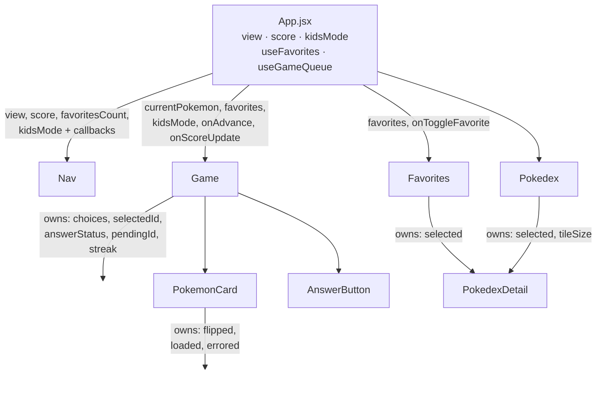
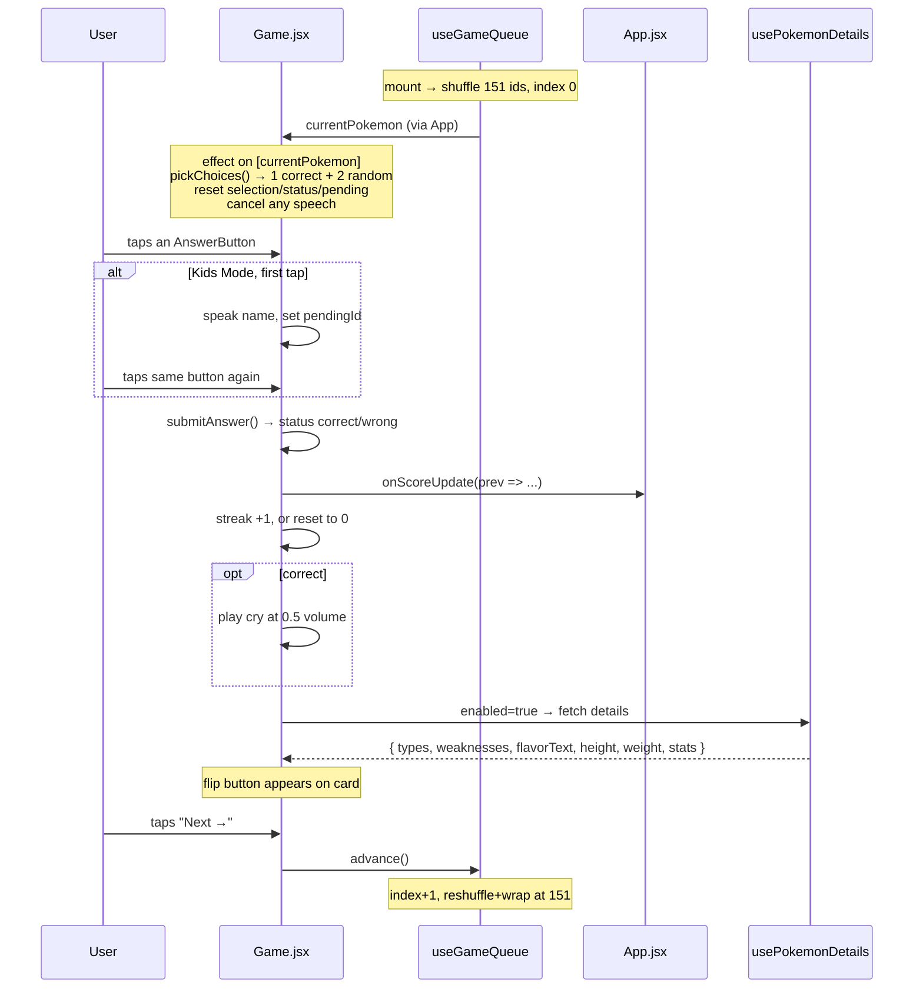

# Architecture — Who's That Pokémon?

A guide to how this app is put together, aimed at someone who wants to change it
confidently. Read top to bottom the first time; after that, jump to the section
for whatever you're touching.

---

## 1. The one-paragraph summary

This is a **client-only React SPA** built with Vite. There is no backend, no
router, no state library, and no database. All 151 original Pokémon are
hardcoded as `{ id, name }` pairs in a single data file; everything else about a
Pokémon (types, stats, flavour text, artwork, cry audio) is fetched on demand
from the public **PokéAPI** and **PokeAPI GitHub sprite/cry repos**. The only
persisted state is favourites and the Kids Mode flag, both in `localStorage`.
The app has three "views" (Play / Favorites / Pokédex) switched by a single
`useState` string in `App.jsx`.

---

## 2. Stack and tooling

| Piece | What it is | Notes |
|---|---|---|
| **React 19** | UI library | Function components + hooks only. No class components, no context, no reducers. |
| **Vite 8** | Dev server + bundler | `vite.config.js` is the stock React plugin config — nothing custom. |
| **ESLint 9** (flat config) | Linting | `eslint.config.js`, with `react-hooks` and `react-refresh` plugins. |
| **Plain CSS** | Styling | One `.css` file per component, imported directly by the component. No preprocessor, no CSS modules, no Tailwind. |

Scripts (`package.json`):

```
npm run dev       # vite dev server with HMR
npm run build     # production bundle into dist/
npm run lint      # eslint over the repo
npm run preview   # serve the built dist/ locally
```

There is **no test setup** and **no TypeScript**. Those are the two most obvious
gaps if you want to make this a "serious" project — see §10.

---

## 3. Boot sequence

```
index.html
  └── loads Google Fonts (Nunito / Fredoka / Orbitron)
  └── <div id="root">
  └── <script type="module" src="/src/main.jsx">
        └── src/main.jsx
              ├── imports src/index.css   (global reset, body gradient, base font)
              └── createRoot(#root).render(<StrictMode><App /></StrictMode>)
```

Two things worth knowing about this boot:

- **StrictMode is on**, so in development every effect runs → cleans up → runs
  again. If you add an effect with a side effect that isn't idempotent (a fetch
  that increments something, an audio play), it will fire twice in dev only.
- **Fonts come from a CDN.** `index.html` is the only place they're declared;
  components reference them by family name in CSS.

---

## 4. File map

```
src/
├── main.jsx                    entry point
├── App.jsx                     root component — owns view + score + kidsMode
├── index.css                   global reset, page background, base typography
├── App.css                     intentionally empty (components own their styles)
│
├── data/                       static, hand-maintained data
│   ├── pokemon.js              POKEMON[151] + the three remote URL builders
│   ├── pronunciations.js       phonetic TTS overrides, keyed by name
│   └── typeColors.js           TYPE_COLORS + TYPE_TEXT_COLORS lookup maps
│
├── hooks/                      all shared logic lives here
│   ├── useFavorites.js         Set<id> backed by localStorage
│   ├── useGameQueue.js         shuffled play order + advance/reset
│   ├── usePokemonDetails.js    PokéAPI fetch + in-memory cache + weakness calc
│   └── useSound.js             fire-and-forget audio playback
│
├── utils/
│   └── shuffle.js              Fisher–Yates, returns a new array
│
└── components/                 one folder per component, .jsx + .css together
    ├── Nav/Nav.jsx             tabs, score badge, Kids Mode toggle, reset modal
    ├── Game/
    │   ├── Game.jsx            the round: choices, answer handling, streak
    │   ├── PokemonCard.jsx     flip card — artwork front, Pokédex data back
    │   └── AnswerButton.jsx    a single answer button, purely presentational
    ├── Favorites/Favorites.jsx grid of favourited Pokémon
    └── Pokedex/
        ├── Pokedex.jsx         grid of all 151, with a tile-size zoom control
        └── PokedexDetail.jsx   the modal used by BOTH Pokedex and Favorites
```

The convention throughout: **components are folders**, each holding a `.jsx`
and its matching `.css`, and the component imports its own stylesheet. Class
names are BEM-ish (`block__element--modifier`), which is what keeps the plain
CSS from colliding across files.

---

## 5. State ownership — the most important section

There's no global store, so "who owns what" is the whole architecture. Here it
is:



### `App.jsx` owns

| State | Type | Persisted? | Purpose |
|---|---|---|---|
| `view` | `'game' \| 'favorites' \| 'pokedex'` | no | which screen is showing |
| `score` | `{ correct, total }` | no | session score, shown in Nav |
| `kidsMode` | `boolean` | **yes** (`kids-mode`) | double-tap-to-confirm + speech |
| `favorites` | `Set<number>` | **yes** (`pokemon-favorites`) | via `useFavorites` |
| queue/index | internal | no | via `useGameQueue` |

Score lives in `App` rather than `Game` for one reason: `Nav` needs to display
it. That's the general rule this codebase follows — state gets lifted only as
far as the nearest component that needs it, and no further.

### A subtle but deliberate rendering choice

```jsx
<div hidden={view !== 'game'}>
  <Game ... />
</div>
{view === 'favorites' && <Favorites ... />}
{view === 'pokedex' && <Pokedex />}
```

`Game` is **always mounted** and merely hidden with the `hidden` attribute,
while the other two views are conditionally rendered. That's why you can tab
away to the Pokédex mid-round and come back to the same question with your
choices, selection and streak intact — unmounting `Game` would throw all of that
away. `Favorites` and `Pokedex` are cheap to rebuild, so they unmount freely.

If you ever add a router, this behaviour is the thing most likely to break.

---

## 6. The data layer

### `data/pokemon.js`

The single source of truth for *which* Pokémon exist:

```js
export const POKEMON = [{ id: 1, name: 'Bulbasaur' }, ... 151 entries];
```

Plus three pure URL builders that point at PokeAPI's GitHub asset repos:

| Function | Returns | Used for |
|---|---|---|
| `getArtworkUrl(id)` | high-res official artwork PNG | the game card, Pokédex modal header |
| `getSpriteUrl(id)` | small game sprite PNG | grid tiles, and as the **artwork fallback** on load error |
| `getCryUrl(id)` | legacy cry `.ogg` | played on a correct answer and from the Pokédex |

Because IDs are just Pokédex numbers, **extending to Gen 2 is mostly a matter of
appending rows to this array** — the URL builders and PokéAPI calls already work
for any valid ID. The parts that would need manual work are
`pronunciations.js` and nothing else.

### `data/pronunciations.js`

A hand-maintained map from display name → a phonetic respelling the browser's
TTS engine says correctly (`Ivysaur → "Ivy sore"`). `getPronunciation(name)`
falls back to the name itself when there's no override, and names the voice
already handles map to themselves so the file doubles as a coverage checklist
for all 151.

### `data/typeColors.js`

`TYPE_COLORS` maps the 18 type names to their canonical hex colours;
`TYPE_TEXT_COLORS` overrides the foreground for the three light types
(electric/ice/normal) that need dark text for contrast. Both are consumed by the
two separate `TypeBadge` implementations — one in `PokemonCard.jsx`, one in
`PokedexDetail.jsx`. They're near-duplicates that differ only in class name and
a glow shadow; consolidating them is an easy first refactor.

---

## 7. The hooks

### `useGameQueue()` — the play order

```js
const [queue, setQueue] = useState(() => shuffle(POKEMON.map(p => p.id)));
const [index, setIndex] = useState(0);
```

It holds a shuffled array of all 151 IDs and a cursor. `advance()` moves the
cursor forward; when it runs off the end it **reshuffles and wraps to 0**, so
you get every Pokémon once per pass in a fresh random order each time. `reset()`
reshuffles and jumps to 0 immediately.

The lazy `useState(() => ...)` initialiser matters — it means the shuffle runs
once on mount, not on every render.

Returns `{ currentPokemon, advance, reset }`, where `currentPokemon` is resolved
from the ID by a `.find()` on every render.

### `useFavorites()` — persisted favourites

A `Set<number>` mirrored to `localStorage['pokemon-favorites']` as a JSON array.
Load is wrapped in try/catch and degrades to an empty set on corrupt data.
`toggleFavorite(id)` **copies the Set** before mutating — required, because
React compares by reference and mutating in place wouldn't re-render.

The write to `localStorage` happens *inside* the state updater. That's a side
effect in a place React doesn't guarantee purity, and under StrictMode the
updater can run twice — harmless here since the write is idempotent, but worth
knowing if you extend it.

### `usePokemonDetails(id, enabled)` — the PokéAPI layer

This is the only network code in the app. Called with `enabled` so it can be
mounted eagerly but only fire when the data is actually needed:

- `Game` passes `enabled = answered` — details load only *after* you've guessed
- `PokedexDetail` passes `enabled = true` — always loads

What it does, in order:

1. Check the module-level `cache` object. If `cache[id]` has stats, return it
   synchronously — no fetch, no loading state.
2. Fetch `/pokemon/{id}` and `/pokemon-species/{id}` in parallel.
3. Pull out types, height, weight and base stats; find the first English
   flavour-text entry and strip its form-feed/newline characters.
4. Fetch `/type/{name}` for each of the Pokémon's 1–2 types.
5. Run `calcWeaknesses()` — union all `double_damage_from` types, union all
   `no_damage_from` types, then subtract the immunities from the weaknesses.
6. Store in `cache[id]` and set state.

**The cache is a plain module-scope object**, so it survives view switches and
component unmounts but not a page reload. It is shared by every consumer of the
hook, which is why opening a Pokémon in the Pokédex makes that same Pokémon's
card back instant later in the game.

A `cancelled` flag in the effect cleanup prevents setting state after unmount or
after a rapid ID change. Fetch errors are swallowed deliberately — the card back
just stays empty rather than breaking the round.

> ⚠️ The second effect (`if (!cache[id]?.stats) setDetails(null)`) exists to
> clear stale data when the ID changes. It runs *after* the fetch effect on the
> same render pass, which is why it re-checks the cache instead of unconditionally
> nulling. It works, but it's the most fragile code in the app.

### `useSound()`

Four lines. Creates a fresh `Audio` per call, sets volume, and swallows the
autoplay-rejection promise. No preloading, no pooling, no way to stop a sound
once started.

---

## 8. The game loop, end to end



### Answer choices

`pickChoices(correct, allPokemon)` filters the correct answer out of the full
list, shuffles, takes 2, then shuffles the correct answer in with them. So the
distractors are drawn uniformly from all 150 others — there's no difficulty
tuning (no "prefer same-type" or "prefer adjacent evolution" logic). That's a
natural place to add depth.

### Answer button states

`getButtonStatus(pokemon)` is a small state machine driving the CSS modifier
class:

| Status | When |
|---|---|
| `idle` | unanswered, or a non-selected wrong option after a *correct* answer |
| `pending` | Kids Mode, first tap — shows "Tap again to choose!" |
| `correct` | the right answer, and you picked it |
| `reveal` | the right answer, shown after you picked wrong |
| `wrong` | the option you picked, and it was wrong |
| `dimmed` | the remaining options after a wrong answer |

`AnswerButton` itself is entirely presentational — status in, class name out.

### Kids Mode

A two-tap confirm flow that also speaks the name. First tap on a button cancels
any in-flight speech, speaks `getPronunciation(name)` through
`SpeechSynthesisUtterance`, and stores `pendingId`. A second tap on the *same*
button submits; a tap on a *different* button just moves the pending state. The
voice is pinned to `Samantha` when available, falling back to any `en-US` voice,
then to the browser default — because the default voice varies wildly across
platforms and mangles Pokémon names.

This is the accessibility/kid-friendliness feature of the app, and it's the
reason `pronunciations.js` exists.

---

## 9. The components in detail

### `Nav.jsx`

Three tab buttons, and — only on the game view — a Kids Mode toggle, the score
badge, and a reset button. The reset button doesn't reset anything directly; it
opens a confirmation overlay (local `confirmReset` state) whose OK button calls
`onNewGame` up in `App`, which reshuffles the queue and zeroes the score.

The overlay uses the standard click-outside-to-close pattern: `onClick` on the
backdrop closes, `e.stopPropagation()` on the card prevents that from firing.

### `PokemonCard.jsx`

A **CSS 3D flip card**. The structure is a `__scene` with `perspective`,
containing two absolutely-positioned `__face` elements with
`backface-visibility: hidden`. The back sits pre-rotated at `-180deg`; adding
`--flipped` to the scene rotates the front to `180deg` and the back to `0deg`.
All of the flipping is CSS — React only toggles one class.

Front face: the artwork, with a holographic shimmer sweep (`::before` /
`::after` pseudo-elements plus a `holoSweep` keyframe). Back face: the Pokédex
data pulled from `usePokemonDetails`.

Three pieces of local state, all reset by an effect keyed on `pokemon.id`:

- `flipped` — which face is showing
- `loaded` — drives the fade-in; a pokeball spinner shows until the image loads
- `errored` — **image fallback chain**: try official artwork, and on error swap
  to the small sprite. The second error is absorbed by setting `loaded` so the
  spinner doesn't hang forever.

The flip button only renders once `answered` is true, so you can't peek at the
answer.

### `Pokedex.jsx` / `Favorites.jsx`

Both are grids of tiles that open the **same** `PokedexDetail` modal, each
passing its own list so the modal's prev/next arrows walk the right collection —
all 151 in the Pokédex, only your favourites in Favorites. That shared-modal
design is the nicest structural decision in the app.

`Pokedex` adds a zoom control: `tileSize` state is written into the grid as a
CSS custom property (`--tile-size`), and the CSS grid sizes its columns off that
variable. React never touches layout directly.

`Favorites` has an effect that closes the modal if the currently-open Pokémon
gets un-favourited out from under it.

> Note: `Pokedex` initialises `tileSize` to `88` but `MIN_SIZE` is `100`, so the
> first "−" click jumps *up* to 100. Minor, but that's a real off-by-default bug.

### `PokedexDetail.jsx`

The modal. Loads details unconditionally, renders type badges, flavour text,
height/weight chips, animated base-stat bars (each `StatBar` gets a `--stat-i`
index so CSS can stagger the fill animations), and weaknesses. Colour-codes stat
bars by value (red < 50, orange < 80, green above). Tints its header with the
primary type's colour at 30%/8% alpha.

Two effects handle modal behaviour: a `keydown` listener for Escape / arrow-key
navigation, and a body `overflow: hidden` lock that restores on unmount.

---

## 10. Known rough edges

Things I'd want you to know before you start changing code. None are urgent;
all are the kind of thing that bites later.

1. **The streak survives a new game.** `App.handleNewGame` resets the queue and
   score, but `streak` lives inside `Game` and its reset effect only clears
   choices/selection/status. Start a new game on a hot streak and the counter
   keeps climbing.
2. **`Pokedex` initial `tileSize` (88) is below `MIN_SIZE` (100).** See above.
3. **`submitAnswer` isn't memoised** but is called from inside the memoised
   `handleAnswer`, and isn't in its dependency array. It happens to be correct
   today because every value `submitAnswer` closes over *is* in `handleAnswer`'s
   deps — but that's a coincidence you'd have to re-verify on every edit.
4. **The card image's alt text says "Pokemon silhouette"** — a leftover from an
   earlier design. The artwork is shown in full; the game is "see the picture,
   pick the name," not a silhouette guess. Either restore the silhouette (a CSS
   `filter: brightness(0)` on the front image until `answered`) or fix the alt.
5. **`TypeBadge` is duplicated** in `PokemonCard.jsx` and `PokedexDetail.jsx`.
6. **The details cache never evicts and never persists.** Fine at 151 entries;
   think about it if you add generations.
7. **No error surface for network failure.** PokéAPI errors are swallowed, so a
   flaky connection looks like a permanently-blank card back.
8. **No tests and no types.** Given how much of the logic is pure —
   `shuffle`, `pickChoices`, `calcWeaknesses`, `getButtonStatus`,
   `getPronunciation` — a test runner would pay for itself quickly. Those five
   functions are where the real behaviour lives.

---

## 11. Where to make common changes

| I want to... | Go to |
|---|---|
| Add more Pokémon (Gen 2+) | `data/pokemon.js` — append rows; add `data/pronunciations.js` entries |
| Change how distractors are chosen | `pickChoices()` at the top of `Game/Game.jsx` |
| Change what shows on the card back | `BackContent` in `Game/PokemonCard.jsx` |
| Add a field from PokéAPI | `hooks/usePokemonDetails.js` — extend the parse and the `result` object |
| Change the play order / repetition | `hooks/useGameQueue.js` |
| Add a fourth answer option | `pickChoices()` `.slice(0, 2)` → `.slice(0, 3)`; check the grid in `Game.css` |
| Add a new view/tab | `App.jsx` (`view` state + render) and `Nav.jsx` (tab button) |
| Change type colours | `data/typeColors.js` |
| Persist something new | Follow the `useFavorites` pattern — a hook that owns state and mirrors it |
| Fix a mispronounced name | `data/pronunciations.js` |
