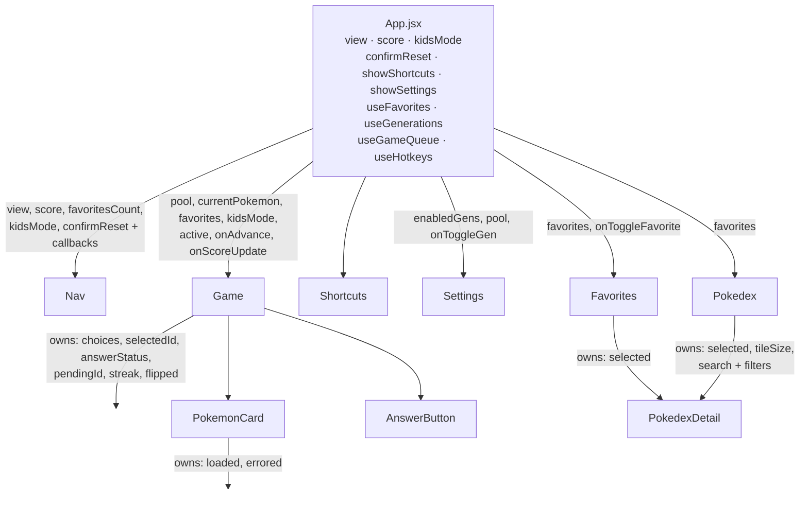
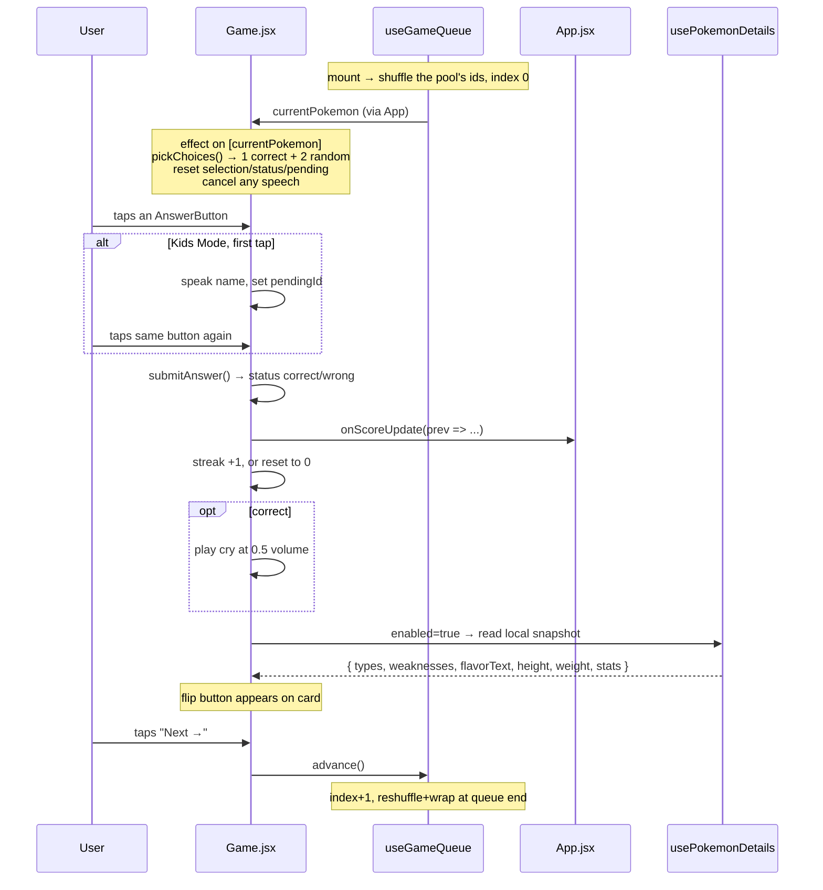

# Architecture — Who's That Pokémon?

A guide to how this app is put together, aimed at someone who wants to change it
confidently. Read top to bottom the first time; after that, jump to the section
for whatever you're touching.

---

## 1. The one-paragraph summary

This is a **client-only React SPA** built with Vite. There is no backend, no
router, no state library, and no database. All 251 Pokémon of Gens I–II are
hardcoded as `{ id, name, gen }` triples in a single data file. Types, stats,
flavour text and weaknesses live in a generated PokéAPI snapshot committed to
the app; only artwork and cry audio come from the PokeAPI GitHub asset repos at
runtime. The only persisted state is favourites, the Kids Mode flag and the
enabled generations, all in `localStorage`.
The app has three "views" (Play / Favorites / Pokédex) switched by a single
`useState` string in `App.jsx`.

---

## 2. Stack and tooling

| Piece | What it is | Notes |
|---|---|---|
| **React 19** | UI library | Function components + hooks only. No class components, no context, no reducers. |
| **Vite 8** | Dev server + bundler | `vite.config.js` is the stock React plugin config — nothing custom. |
| **ESLint 9** (flat config) | Linting | `eslint.config.js`, with `react-hooks` and `react-refresh` plugins. |
| **Plain CSS** | Styling | One `.css` file per component, imported directly by the component. No preprocessor, no CSS modules, no Tailwind. |

Scripts (`package.json`):

```
npm run dev           # vite dev server with HMR
npm run build         # production bundle into dist/
npm run generate:data # refresh the checked-in PokéAPI details snapshot
npm run lint          # eslint over the repo
npm run preview       # serve the built dist/ locally
```

There is **no test setup** and **no TypeScript**. Those are the two most obvious
gaps if you want to make this a "serious" project — see §10.

---

## 3. Boot sequence

```
index.html
  └── loads Google Fonts (Nunito / Fredoka / Orbitron)
  └── <div id="root">
  └── <script type="module" src="/src/main.jsx">
        └── src/main.jsx
              ├── imports src/index.css   (global reset, body gradient, base font)
              └── createRoot(#root).render(<StrictMode><App /></StrictMode>)
```

Two things worth knowing about this boot:

- **StrictMode is on**, so in development every effect runs → cleans up → runs
  again. If you add an effect with a side effect that isn't idempotent (a fetch
  that increments something, an audio play), it will fire twice in dev only.
- **Fonts come from a CDN.** `index.html` is the only place they're declared;
  components reference them by family name in CSS.

---

## 4. File map

```
scripts/
└── generate-pokemon-details.mjs  validated PokéAPI snapshot generator
src/
├── main.jsx                    entry point
├── App.jsx                     root component — owns view + score + kidsMode
├── index.css                   global reset, page background, base typography
├── App.css                     intentionally empty (components own their styles)
│
├── data/                       static app data
│   ├── pokemonDetails.json     generated types/stats/text/weaknesses snapshot
│   ├── pokemon.js              GENERATIONS + POKEMON[251] + the three URL builders
│   ├── pronunciations.js       phonetic TTS overrides, keyed by name
│   └── typeColors.js           TYPE_COLORS + TYPE_TEXT_COLORS lookup maps
│
├── hooks/                      all shared logic lives here
│   ├── useFavorites.js         Set<id> backed by localStorage
│   ├── useGameQueue.js         shuffled play order over a pool + advance/reset
│   ├── useGenerations.js       Set<genId> in localStorage + the derived pool
│   ├── usePokemonDetails.js    synchronous adapter over the generated snapshot
│   ├── useSound.js             fire-and-forget audio playback
│   └── useHotkeys.js           document-level keydown listener, gated by `enabled`
│
├── utils/
│   ├── filterPokemon.js        pure Pokédex search/filter predicates
│   └── shuffle.js              Fisher–Yates, returns a new array
│
└── components/                 one folder per component, .jsx + .css together
    ├── Nav/Nav.jsx             tabs, score badge, Kids Mode toggle, reset modal
    ├── Game/
    │   ├── Game.jsx            the round: choices, answer handling, streak, hotkeys
    │   ├── PokemonCard.jsx     flip card — artwork front, Pokédex data back
    │   └── AnswerButton.jsx    a single answer button, purely presentational
    ├── Shortcuts/Shortcuts.jsx  the `?` keyboard-shortcuts modal
    ├── Settings/Settings.jsx   the ⚙ modal — which generations are in the pool
    ├── Favorites/Favorites.jsx grid of favourited Pokémon
    └── Pokedex/
        ├── Pokedex.jsx         searchable/filterable grid with tile-size controls
        └── PokedexDetail.jsx   the modal used by BOTH Pokedex and Favorites
```

The convention throughout: **components are folders**, each holding a `.jsx`
and its matching `.css`, and the component imports its own stylesheet. Class
names are BEM-ish (`block__element--modifier`), which is what keeps the plain
CSS from colliding across files.

---

## 5. State ownership — the most important section

There's no global store, so "who owns what" is the whole architecture. Here it
is:



### `App.jsx` owns

| State | Type | Persisted? | Purpose |
|---|---|---|---|
| `view` | `'game' \| 'favorites' \| 'pokedex'` | no | which screen is showing |
| `score` | `{ correct, total }` | no | session score, shown in Nav |
| `kidsMode` | `boolean` | **yes** (`kids-mode`) | double-tap-to-confirm + speech |
| `favorites` | `Set<number>` | **yes** (`pokemon-favorites`) | via `useFavorites` |
| `enabledGens` | `Set<number>` | **yes** (`pokemon-generations`) | via `useGenerations`; also yields `pool` |
| `confirmReset` | `boolean` | no | the reset-confirmation modal `Nav` renders |
| `showShortcuts` | `boolean` | no | the `?` shortcuts overlay |
| `showSettings` | `boolean` | no | the ⚙ settings overlay |
| queue/index | internal | no | via `useGameQueue` |

Score lives in `App` rather than `Game` for one reason: `Nav` needs to display
it. That's the general rule this codebase follows — state gets lifted only as
far as the nearest component that needs it, and no further.

`confirmReset` lives in `App` rather than `Nav` for the same reason `score`
does — something outside `Nav` needs it, namely the `N` hotkey. `Nav` still
renders the modal; it just doesn't own whether it's open.

### A subtle but deliberate rendering choice

```jsx
<div hidden={view !== 'game'}>
  <Game ... />
</div>
{view === 'favorites' && <Favorites ... />}
{view === 'pokedex' && <Pokedex favorites={favorites} />}
```

`Game` is **always mounted** and merely hidden with the `hidden` attribute,
while the other two views are conditionally rendered. That's why you can tab
away to the Pokédex mid-round and come back to the same question with your
choices, selection and streak intact — unmounting `Game` would throw all of that
away. `Favorites` and `Pokedex` are cheap to rebuild, so they unmount freely.

If you ever add a router, this behaviour is the thing most likely to break.

---

## 6. The data layer

### `data/pokemon.js`

The single source of truth for *which* Pokémon exist:

```js
export const GENERATIONS = [
  { id: 1, label: 'Gen I',  region: 'Kanto', range: [1, 151] },
  { id: 2, label: 'Gen II', region: 'Johto', range: [152, 251] },
];
export const POKEMON = [{ id: 1, name: 'Bulbasaur', gen: 1 }, ... 251 entries];
```

`gen` keys each Pokémon to a `GENERATIONS` row. `GENERATIONS` is what the
settings modal renders from, so a new generation is one row there plus the
`POKEMON` entries, followed by `npm run generate:data` — no UI change.

### `data/pokemonDetails.json`

A generated, checked-in snapshot containing the types, correctly combined
weaknesses, English flavour text, dimensions and six base stats used by the UI.
The browser imports this file with the application bundle, so displaying details
does not make a PokéAPI REST request and cannot enter a loading/error state.

`scripts/generate-pokemon-details.mjs` is the source of this file. It fetches
the Pokémon and species records with limited concurrency, fetches each shared
type record once, calculates dual-type damage multipliers, validates all 251
records, then replaces the JSON atomically. The normal production build never
runs the generator; refresh the snapshot deliberately with `npm run generate:data`
and commit its output.

Plus three pure URL builders that point at PokeAPI's GitHub asset repos:

| Function | Returns | Used for |
|---|---|---|
| `getArtworkUrl(id)` | high-res official artwork PNG | the game card, Pokédex modal header |
| `getSpriteUrl(id)` | small game sprite PNG | grid tiles, and as the **artwork fallback** on load error |
| `getCryUrl(id)` | legacy cry `.ogg` | played on a correct answer and from the Pokédex |

Because IDs are just Pokédex numbers, the URL builders work for any valid ID —
**extending to a further generation is appending rows here, adding one
`GENERATIONS` entry and the matching `pronunciations.js` names, then regenerating
`pokemonDetails.json`.** One
caveat the builders hide: `getCryUrl` points at the `legacy` cry set, which only
covers Gens I–V. Gen VI onward would need the `latest` path.

### `data/pronunciations.js`

A hand-maintained map from display name → a phonetic respelling the browser's
TTS engine says correctly (`Ivysaur → "Ivy sore"`). `getPronunciation(name)`
falls back to the name itself when there's no override, and names the voice
already handles map to themselves so the file doubles as a coverage checklist
for all 251. A missing entry fails silently — you just get the raw name read
aloud — so check coverage explicitly after adding Pokémon.

### `data/typeColors.js`

`TYPE_COLORS` maps the 18 type names to their canonical hex colours;
`TYPE_TEXT_COLORS` overrides the foreground for the three light types
(electric/ice/normal) that need dark text for contrast. Both are consumed by the
two separate `TypeBadge` implementations — one in `PokemonCard.jsx`, one in
`PokedexDetail.jsx`. They're near-duplicates that differ only in class name and
a glow shadow; consolidating them is an easy first refactor.

---

## 7. The hooks

### `useGameQueue(pool)` — the play order

```js
const [queue, setQueue] = useState(() => shuffle(pool.map(p => p.id)));
const [index, setIndex] = useState(0);
```

It holds a shuffled array of the pool's IDs and a cursor. `advance()` moves the
cursor forward; when it runs off the end it **reshuffles and wraps to 0**, so
you get every Pokémon once per pass in a fresh random order each time. `reset()`
reshuffles and jumps to 0 immediately. The wrap check compares against
`queue.length`, not `pool.length` — the queue is the authority on how many are
left in the current pass.

**Changing the pool starts a fresh pass**, handled by a render-phase adjustment
(`if (pool !== poolRef) { ... }`) rather than an effect, so React re-renders with
the corrected queue before committing and nothing observes the mismatched pair.
That's also why `useGenerations` memoises `pool` — a fresh array each render
would reshuffle forever. Note this resets the round but *not* the score, which
lives in `App`.

The lazy `useState(() => ...)` initialiser matters — it means the shuffle runs
once on mount, not on every render.

Returns `{ currentPokemon, advance, reset }`, where `currentPokemon` is resolved
from the ID by a `.find()` on every render.

### `useGenerations()` — which generations are in play

The same shape as `useFavorites`: a `Set<number>` of generation IDs mirrored to
`localStorage['pokemon-generations']`, defaulting to **all generations** on
missing or corrupt data, and intersected with `GENERATIONS` on load so a stale
key can't smuggle in an unknown ID. `toggleGen` **refuses to remove the last
enabled generation** — the pool can never be empty. It also returns the derived
`pool` (`POKEMON` filtered by the enabled gens), memoised on `enabledGens`.

The filter is deliberately **game-only**. `Pokedex` and `Favorites` still import
`POKEMON` directly, so browsing always covers all 251 and turning a generation
off never makes a favourite disappear.

### `useFavorites()` — persisted favourites

A `Set<number>` mirrored to `localStorage['pokemon-favorites']` as a JSON array.
Load is wrapped in try/catch and degrades to an empty set on corrupt data.
`toggleFavorite(id)` **copies the Set** before mutating — required, because
React compares by reference and mutating in place wouldn't re-render.

The write to `localStorage` happens *inside* the state updater. That's a side
effect in a place React doesn't guarantee purity, and under StrictMode the
updater can run twice — harmless here since the write is idempotent, but worth
knowing if you extend it.

### `usePokemonDetails(id, enabled)` — the snapshot adapter

This small compatibility hook reads `data/pokemonDetails.json` synchronously.
`Game` still passes `enabled = answered` so details remain hidden until a guess,
while `PokedexDetail` passes `enabled = true`. It returns the same
`{ details, loading }` shape the components used before the snapshot migration,
but `loading` is always false. Keeping the adapter avoids coupling the generated
file directly to multiple components.

### `useHotkeys(handler, enabled)`

Attaches one `keydown` listener to `document` while `enabled` is true, and drops
events that originate from a text input or `contenteditable`. The handler gets
the raw event and decides on `preventDefault()` itself — the hook has no key map
of its own.

Two consumers: `App` (the `N` / `?` / `Escape` keys) and `Game` (everything
else). **`enabled` is load-bearing in `Game`**, because `Game` stays mounted
behind `hidden` on the other tabs — see §5.

### `useSound()`

Four lines. Creates a fresh `Audio` per call, sets volume, and swallows the
autoplay-rejection promise. No preloading, no pooling, no way to stop a sound
once started.

---

## 8. The game loop, end to end



### Answer choices

`pickChoices(correct, allPokemon)` filters the correct answer out of the list,
shuffles, takes 2, then shuffles the correct answer in with them. `Game` passes
the `pool` prop, so distractors only ever come from enabled generations. They're
drawn uniformly from the rest of the pool — there's no difficulty tuning (no
"prefer same-type" or "prefer adjacent evolution" logic). That's a natural place
to add depth.

### Answer button states

`getButtonStatus(pokemon)` is a small state machine driving the CSS modifier
class:

| Status | When |
|---|---|
| `idle` | unanswered, or a non-selected wrong option after a *correct* answer |
| `pending` | Kids Mode, first tap — shows "Tap again to choose!" |
| `correct` | the right answer, and you picked it |
| `reveal` | the right answer, shown after you picked wrong |
| `wrong` | the option you picked, and it was wrong |
| `dimmed` | the remaining options after a wrong answer |

`AnswerButton` itself is entirely presentational — status in, class name out.

### Keyboard controls

A round is fully playable from the keyboard. The design principle is **real DOM
focus is the highlight** — arrow keys just move focus between the three answer
buttons via `answerRefs`, and Space/Enter then fires that button's existing
`onClick` natively. `handleAnswer` therefore needs no keyboard branch at all, and
the Kids Mode two-press flow works from the keyboard for free. `:focus-visible`
draws the highlight ring, so mouse and touch players never see it.

| Key | Action |
|---|---|
| `↑` `↓` `←` `→` | move between the answers, wrapping (all four axes, because the layout is a column on mobile and a 3-up grid at ≥768px) |
| `Enter` / `Space` | lock in the focused answer; press again for Next → |
| `F` | flip the card (once answered) |
| `H` | toggle favourite |
| `N` | open the reset-confirmation modal |
| `?` | open/close the shortcuts overlay |
| `Escape` | close whichever overlay is open |

Three details that aren't obvious from the code:

- **`Game` only listens while `active`.** `App` passes
  `active={view === 'game' && !overlayOpen}`, so the keys go quiet on the other
  tabs (where `Game` is merely `hidden`, not unmounted) and behind modals.
- **`ADVANCE_LOCKOUT_MS`.** Because the same key both answers and advances, a
  fast double-press would otherwise skip straight past the reveal and the cry.
  `submitAnswer` stamps `answeredAt`, and the advance branch ignores presses
  within 400ms of it.
- **Focus resumes across rounds.** Submitting disables the answer buttons, which
  drops focus to `<body>`. When the advance came from a keypress, `resumeFocus`
  is set and an effect keyed on `choices` focuses the first answer of the next
  round — so keyboard play doesn't need a fresh arrow press each time. It's
  keyed on `choices` rather than `currentPokemon` because the buttons don't
  exist yet when the reset effect runs.

### Kids Mode

A two-tap confirm flow that also speaks the name. First tap on a button cancels
any in-flight speech, speaks `getPronunciation(name)` through
`SpeechSynthesisUtterance`, and stores `pendingId`. A second tap on the *same*
button submits; a tap on a *different* button just moves the pending state. The
voice is pinned to `Samantha` when available, falling back to any `en-US` voice,
then to the browser default — because the default voice varies wildly across
platforms and mangles Pokémon names.

This is the accessibility/kid-friendliness feature of the app, and it's the
reason `pronunciations.js` exists.

---

## 9. The components in detail

### `Nav.jsx`

Three tab buttons, and — only on the game view — a Kids Mode toggle, a `⚙`
settings button, a `⌨` shortcuts button (hidden under `@media (hover: none)`,
since a touch device has no use for it — `⚙` deliberately is *not*, being the
only way to reach the generation picker on touch), the score badge, and a reset
button. The reset button doesn't
reset anything directly; it asks `App` to open a confirmation overlay, whose OK
button calls `onNewGame`, which reshuffles the queue and zeroes the score.

`Nav` is now fully controlled — it holds no state of its own.

The overlay uses the standard click-outside-to-close pattern: `onClick` on the
backdrop closes, `e.stopPropagation()` on the card prevents that from firing.

### `PokemonCard.jsx`

A **CSS 3D flip card**. The structure is a `__scene` with `perspective`,
containing two absolutely-positioned `__face` elements with
`backface-visibility: hidden`. The back sits pre-rotated at `-180deg`; adding
`--flipped` to the scene rotates the front to `180deg` and the back to `0deg`.
All of the flipping is CSS — React only toggles one class.

Front face: the artwork, with a holographic shimmer sweep (`::before` /
`::after` pseudo-elements plus a `holoSweep` keyframe). Back face: the Pokédex
data read from the local snapshot through `usePokemonDetails`.

Which face is showing (`flipped`) is a **prop**, owned by `Game` so the `F`
hotkey can reach it. Two pieces of local state remain; `Game` keys the component
by `pokemon.id`, so both naturally reset when the Pokémon changes:

- `loaded` — drives the fade-in; a pokeball spinner shows until the image loads
- `errored` — **image fallback chain**: try official artwork, and on error swap
  to the small sprite. The second error is absorbed by setting `loaded` so the
  spinner doesn't hang forever.

The flip button only renders once `answered` is true, so you can't peek at the
answer.

### `Settings.jsx`

The `⚙` overlay, built on the same recipe as `Shortcuts` (fixed backdrop, click
outside to close, `stopPropagation` on the card). Purely presentational — it
renders one toggle row per `GENERATIONS` entry with a live count of the pool, and
disables the checkbox of the last enabled generation so `toggleGen`'s guard is
visible rather than a silent no-op. Add a generation to the data and this UI
picks it up with no edit.

### `Pokedex.jsx` / `Favorites.jsx`

Both are grids of tiles that open the **same** `PokedexDetail` modal, each
passing its own list so the modal's prev/next arrows walk the right collection —
all 251 in the Pokédex, only your favourites in Favorites. That shared-modal
design is the nicest structural decision in the app.

`Pokedex` combines name/number search with generation, type and favorites
filters. `filterPokemon()` keeps that derivation separate from the component,
and the result count plus empty state reflect the combined filter set. Detail
modal navigation uses the filtered list, so previous/next stays within the
visible result set.

Its zoom control writes `tileSize` state into the grid as a CSS custom property
(`--tile-size`), and the CSS grid sizes its columns off that variable. React
never touches layout directly.

`Favorites` closes the detail modal as part of its removal action if the
currently-open Pokémon gets un-favourited.

### `PokedexDetail.jsx`

The modal. Loads details unconditionally, renders type badges, flavour text,
height/weight chips, animated base-stat bars (each `StatBar` gets a `--stat-i`
index so CSS can stagger the fill animations), and weaknesses. Colour-codes stat
bars by value (red < 50, orange < 80, green above). Tints its header with the
primary type's colour at 30%/8% alpha.

Two effects handle modal behaviour: a `keydown` listener for Escape / arrow-key
navigation, and a body `overflow: hidden` lock that restores on unmount.

---

## 10. Known rough edges

Things I'd want you to know before you start changing code. None are urgent;
all are the kind of thing that bites later.

1. **The streak survives a new game.** `App.handleNewGame` resets the queue and
   score, but `streak` lives inside `Game` and its reset effect only clears
   choices/selection/status. Start a new game on a hot streak and the counter
   keeps climbing.
2. **`TypeBadge` is duplicated** in `PokemonCard.jsx` and `PokedexDetail.jsx`.
3. **The generated details snapshot can go stale.** Adding Pokémon or changing
   its schema requires running `npm run generate:data` and committing the JSON.
4. **No tests and no types.** Given how much of the logic is pure —
   `shuffle`, `filterPokemon`, `pickChoices`, `getDamageMultiplier`, `getButtonStatus`,
   `getPronunciation` — a test runner would pay for itself quickly. Those six
   functions are where the real behaviour lives.

---

## 11. Where to make common changes

| I want to... | Go to |
|---|---|
| Add more Pokémon (Gen 3+) | Add `data/pokemon.js` and `data/pronunciations.js` entries, run `npm run generate:data`, and commit `data/pokemonDetails.json`. Past Gen V, also switch `getCryUrl` off the `legacy` path |
| Change how distractors are chosen | `pickChoices()` at the top of `Game/Game.jsx` |
| Change what shows on the card back | `BackContent` in `Game/PokemonCard.jsx` |
| Add a field from PokéAPI | Extend `scripts/generate-pokemon-details.mjs`, regenerate the snapshot, then render the field where needed |
| Change the play order / repetition | `hooks/useGameQueue.js` |
| Change what's in the play pool | `hooks/useGenerations.js` (and `Settings.jsx` if it needs new controls) |
| Add a fourth answer option | `pickChoices()` `.slice(0, 2)` → `.slice(0, 3)`; check the grid in `Game.css` |
| Add a new view/tab | `App.jsx` (`view` state + render) and `Nav.jsx` (tab button) |
| Change type colours | `data/typeColors.js` |
| Persist something new | Follow the `useFavorites` pattern — a hook that owns state and mirrors it |
| Fix a mispronounced name | `data/pronunciations.js` |
